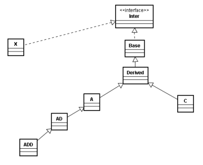

# Aufgabe 'Generics - Platzhalter'

Gegeben ist folgende Vererbungshierarchie:

Es existiert auch eine main-Methode in der folgende Variablen definiert werden:
 
		List list = null;
		List<?> listUnknown = null;//? = ? extends Object
		List<Object> listObject = null;
		List<? super Object> listSuperObject = null;
		List<? extends Object> listExtendsObject = null;
		List<Inter> listInter = null;
		List<? super Inter> listSuperInter = null;
		List<? extends Inter> listExtendsInter = null;
		List<Base> listBase = null;
		List<? super Base> listSuperBase = null;
		List<? extends Base> listExtendsBase = null;
		List<Derived> listDerived = null;
		List<? super Derived> listSuperDerived = null;
		List<? extends Derived> listExtendsDerived = null;
		List<A> listA = null;
		List<? super A> listSuperA = null;
		List<? extends A> listExtendsA = null;
		List<C> listC = null;
		List<? super C> listSuperC = null;
		List<? extends C> listExtendsC = null;
		List<AD> listAD = null;
		List<? super AD> listSuperAD = null;
		List<? extends AD> listExtendsAD = null;
		List<ADD> listADD = null;
		List<? super ADD> listSuperADD = null;
		List<? extends ADD> listExtendsADD = null;

Welche der folgenden Zuweisungen werden kompilieren?

		1.   listSuperA  = listSuperInter;
		2.   listDerived = listSuperC;
		3.   listExtendsADD  = listADD;
		4.   listExtendsBase = listExtendsADD;
		5.   listAD  = listBase;
		6.   listADD = listSuperA;
		7.   listExtendsBase = listExtendsBase;
		8.   listBase    = listExtendsADD;
		9.   listObject  = listExtendsDerived;
		10. listSuperA  = listExtendsInter;
		11. listSuperObject = listAD;
		12. listSuperC = listExtendsAD;
		13. listExtendsAD = listExtendsADD;
		14. listDerived = listADD;
		15. listADD = listA;
		16. listBase = listA;
		17. listSuperBase = listInter;
		18. listSuperBase = listUnknown;
		19. listExtendsObject = listA;
		20. listExtendsC = listSuperC;
		21. listUnknown = listExtendsAD;
		22. listSuperDerived = listA;
		23. listSuperDerived = listInter;
		24. listDerived = listAD;
		25. listExtendsInter = listSuperBase;
		26. listExtendsBase = list;
		27. listExtendsObject = listExtendsC;
		28. listAD = listObject;
		29. listExtendsC = listUnknown;
		30. listSuperC = listA;
		31. listExtendsInter = listExtendsBase;
		32. listExtendsObject = listSuperDerived;
		33. listExtendsObject = listExtendsADD;
		34. listSuperDerived = listExtendsC;
		35. listAD = listSuperObject;
		36. listSuperAD = listSuperDerived;
		37. listExtendsAD = listA;
		38. listUnknown = listSuperC;
		39. listExtendsADD = listC;
		40. listAD = listSuperAD;
		41. listSuperBase = listExtendsAD;
		42. listC = listSuperA;
		43. listA = listInter;
		44. list = listSuperAD;
		45. listObject = listExtendsInter;
		46. listSuperA = listSuperA;
		47. listExtendsAD = listExtendsC;
		48. list = listADD;
		49. listA = listDerived;
		50. listUnknown = listSuperA;
